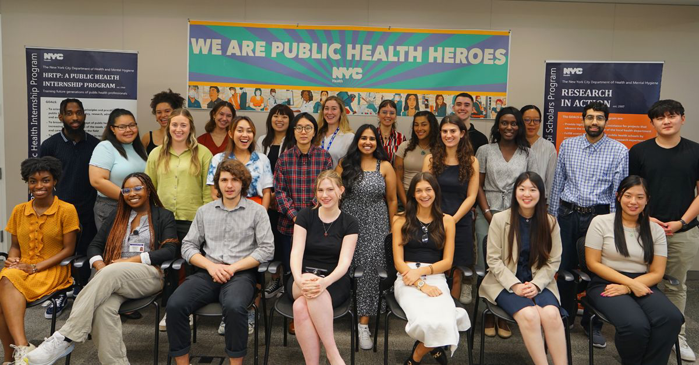
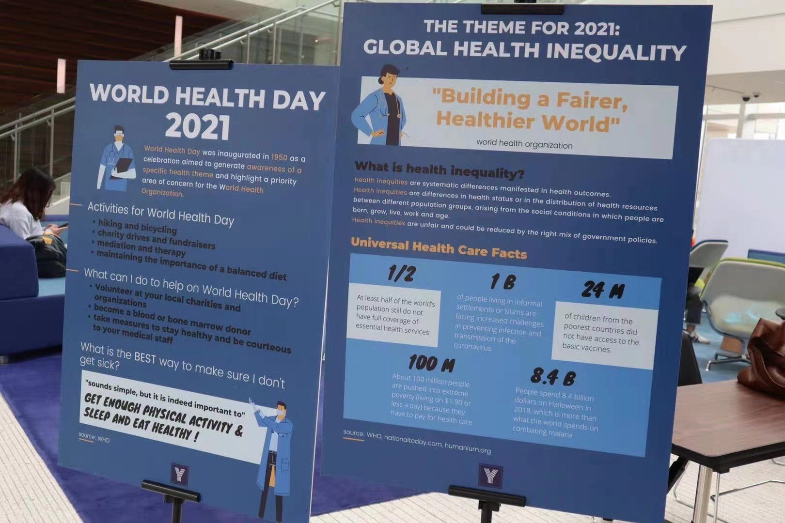
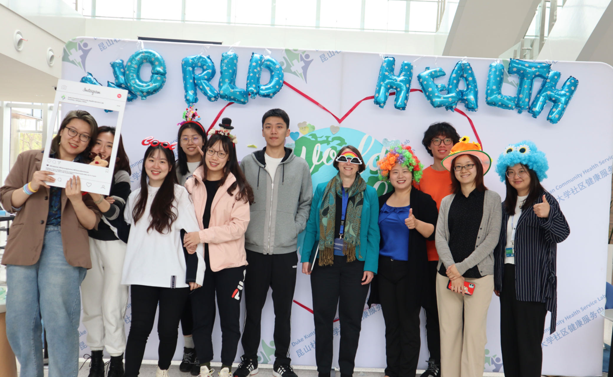

```{r setup, include=FALSE}
knitr::opts_chunk$set(echo = TRUE)
```
This page has information about me.

<br>

### Introduction 
I am a second-year student studying Master of Public Health at Columbia University. I had my BS degree in Global Health (Biology concentration) at Duke Kunshan University. I was born in Nanjing, China, a city with a long history, tender nature, and modern developments. I am now living and studying in New York, pursuing my master's degree in public health. With my strong interest in promoting health equity, I hope to enable better access to healthcare resources for all. I am a determined and self-motivated person, who is also easy to approach and very willing to help. I am proficient in statistical software such as SAS, R, GIS, Python, and Stata. 

<br>

### Education

I graduated from [Duke Kunshan University](https://www.dukekunshan.edu.cn/) with a Bachelor of Science Degree in Global Health and Biology. Now I am doing my MPH with a certificate in Epidemiology of Chronic Disease at [Columbia University](https://www.columbia.edu/) in the city.


<br>

### Career 

***New York City Department of Health and Mental Hygiene, Intern, 2023***

I am currently a Intern at the [New York City Department of Health and Mental Hygiene](https://www.nyc.gov/site/doh/index.page) in New York, NY, working within the Department of Epidemiology, Bureau of Epidemiology Services, starting from July 2023. In this role, I have been engaged in impactful research focused on understanding the prevalence of food insecurity in New York City. I conducted a comprehensive validation analysis using Hunger Vital Sign as a new indicator to measure food insecurity, leveraging statistical tools like SAS and SUDAAN. My responsibilities also included evaluating the discordance and concordance of food insecurity status as determined by the Hunger Vital Sign and the gold standard, while exploring predictive variables, including the presence of multiple chronic diseases, through multinomial regression analysis. Moreover, I have applied machine learning techniques to predict food insecurity status, utilizing sociodemographic information and food support-related features. This experience has allowed me to contribute to the critical work of addressing food insecurity issues in our community and developing innovative approaches to tackle this public health challenge.



<br>

***Duke Kunshan University, Student Researcher, 2020-2022***


During my research and analysis work, I conducted a study examining the relationship between heart rate and all-cause mortality among Chinese adults aged 65-79 from March 2021 to May 2022. This involved survival analysis using R, crude adjustments for mortality rates, and the development of multivariable-adjusted Cox proportional hazard regression models. Additionally, I contributed to a Community Empowerment-Based Approach (CEBA) study focused on health management for chronic disease patients in urban China, where I collected physical health information through surveys and interviews, and transcribed project interviews related to the National Natural Science Foundation of China's research. I was also the co-funder of Community Health Service Lab at Duke Kunshan University where we organized World Health Day Event and provided free type-2 diabetes prevention curriculum to local Kunshan senior residences. 




<br>

### Research Interest

I am passionate about conducting research on chronic diseases, with a particular focus on utilizing machine learning methods to predict chronic disease outcomes by analyzing biomarkers. Additionally, I have a keen interest in investigating and addressing the issue of food insecurity in New York City, which has the potential to inform and contribute to health policy decision-making.



<br>

### Publications

These are some of my publications (Please feel free to check if you are interested):

* He, Z., Guo, Q., Ling, Y., Hong, C., Liu, Y et al., (2022). Aldehyde dehydrogenase 2 rs671 polymorphism and multiple
diseases: protocol for a quantitative umbrella review of meta-analyses. Syst Rev 11, 185. https://doi.org/10.1186/s13643-022-02050-y

* Cao, S., Huang, H., Bo, S., Feng, M., Liang, Y., Liu, Y et al., (2022). What influences informal caregivers' risk
perceptions and responses to home care safety of older adults with disabilities: A qualitative study. Frontiers in public
health, 10.