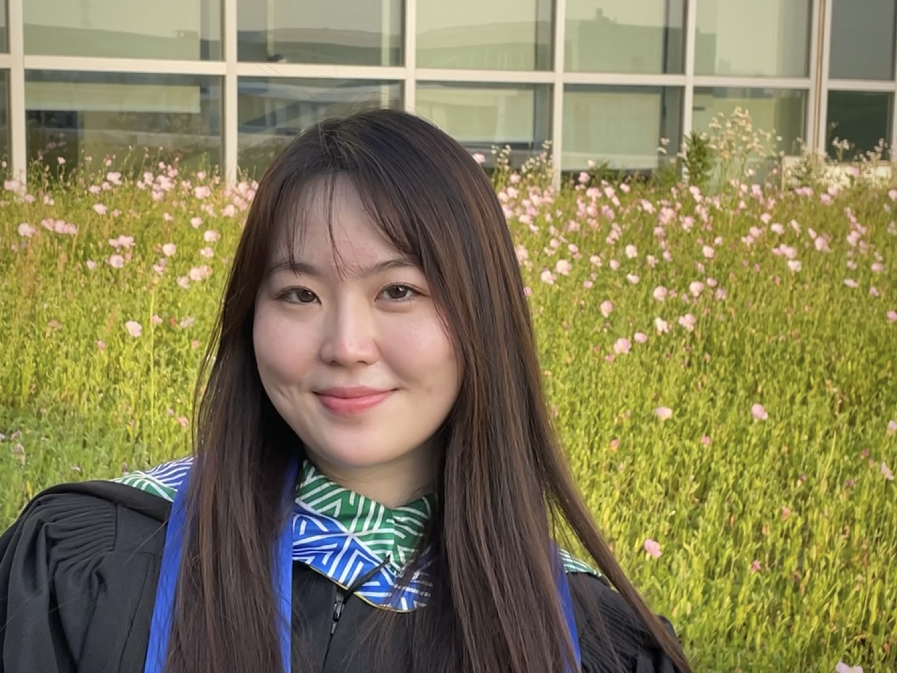

```{r setup, include=FALSE}
knitr::opts_chunk$set(echo = TRUE)
```
This page has information about me.

## Introduction 
I am a second-year student studying Master of Public Health at Columbia University. I had my BS degree in Global Health (Biology concentration) at Duke Kunshan University. I was born in Nanjing, China, a city with a long history, tender nature, and modern developments. I am now living and studying in New York, pursuing my master's degree in public health. With my strong interest in promoting health equity, I hope to enable better access to healthcare resources for all. I am a determined and self-motivated person, who is also easy to approach and very willing to help. I am proficient in statistical software such as SAS, R, GIS, Python, and Stata. 

## Education

I graduated from Duke Kunshan University with a Bachelor of Science Degree in Global Health and Biology. Now I am doing my MPH with a certificate in Epidemiology of Chronic Disease in the city.




## Research Interest

I am passionate about conducting research on chronic diseases, with a particular focus on utilizing machine learning methods to predict chronic disease outcomes by analyzing biomarkers. Additionally, I have a keen interest in investigating and addressing the issue of food insecurity in New York City, which has the potential to inform and contribute to health policy decision-making.

## Publications

These are some of my publications:

* He, Z., Guo, Q., Ling, Y., Hong, C., Liu, Y et al., (2022). Aldehyde dehydrogenase 2 rs671 polymorphism and multiple
diseases: protocol for a quantitative umbrella review of meta-analyses. Syst Rev 11, 185. https://doi.org/10.1186/s13643-022-02050-y

* Cao, S., Huang, H., Bo, S., Feng, M., Liang, Y., Liu, Y et al., (2022). What influences informal caregivers' risk
perceptions and responses to home care safety of older adults with disabilities: A qualitative study. Frontiers in public
health, 10.