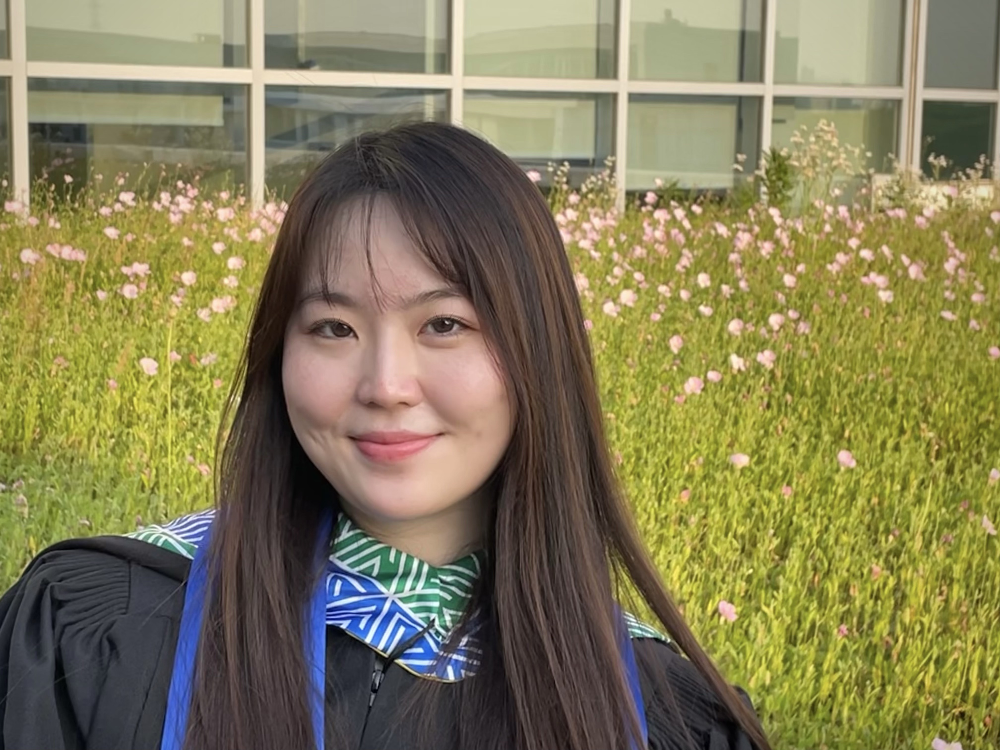

# This is Yuqing's awesome website

This site is a webpage created by Yuqing leveraging the skills and techniques learned in [p8120 Data Science](https://p8105.com/) course in Columbia University Master of Public Health program. Further details about my educational background and access to my resume can be found on the [about](about.html) page. Thanks for visiting and I hope you like my website. 

## Github page
Here is a [link](https://github.com/yuqingliu6) to my github page. 

[About me](about.html )

